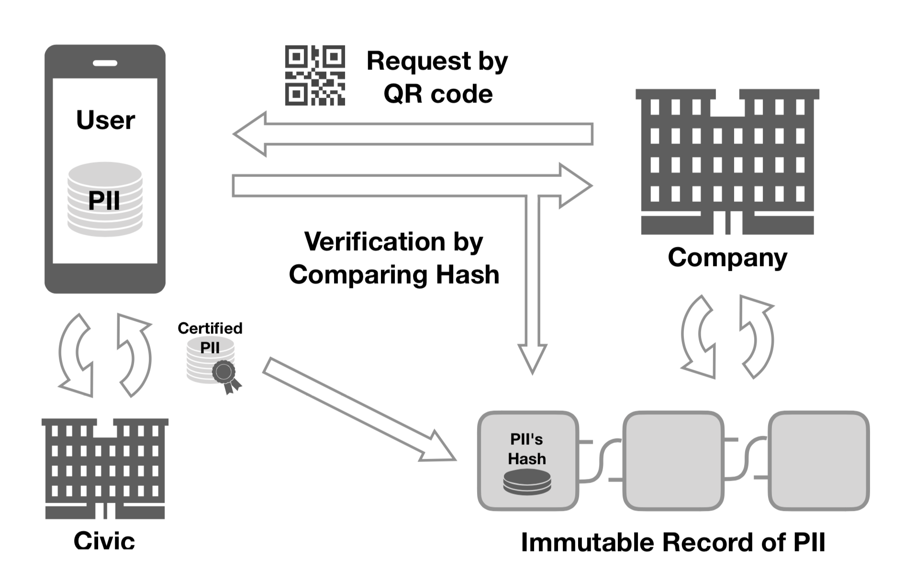

# KYC Platforms Review #

---

#### 블록체인기반 KYC 플랫폼 ###

- [Civic](https://www.civic.com)
- [Uport](https://www.uport.me)
- [Sovrin](https://sovrin.org)
- [Metadium](https://www.metadium.com)

---

#### 특징 1 - KYC 비용 절감

 - Reusable KYC
 - 최초 신원 검증 결과를 블록체인에 기록
 - 그 후 블록체인에 남아있는 기록을 참조

--

#### 특징 2 - 개인 정보 및 정보 주권 보호
- 개인 정보를 주고 받지 않음 
- 오로지 블록체인에 올라가 있는 검증 상태만 확인
- 개인정보 확인 요청을 앱상으로 사용자에게 전달
- 사용자가 확인 후 개별적으로/선택적으로 승인 가능

--

#### 특징 3 - 토큰 경제 생태계 추구 

---

#### Civic (1/2) ###

- 기반 블록체인: RSK(Bitcoin 기반 사이드체인)
- 개인정보를 사용자의 스마트기기 내부에 저장
- 자체적으로 최초 신원확인 후 블록체인에 확인 여부를 기록
- QR 코드를 이용해 신원확인 요청 / 사용자가 앱으로 확인 후 승인
- 현재 서비스 중

--

#### Civic (2/2) ###

---

#### Uport (1/2)

- Ethereum Smart Contract 기반
- 개인정보를 암호화해서 IPFS에 저장
- 개인별로 발급된 가상 주소를 통해 작동(Proxy Contract)
- 현재 앱만 존재 / 서비스는 아직 준비 중

--

#### Uport(2/2)

---

#### Metadium(1/3)

- 자체 메인넷 계획 중(Bigger Block Size, Instant Block Creation)
- Proof of Authority 사용 예정 
- Meta Oracle - 사이드체인과 인터체인을 통해서 플랫폼의 확장성(Expandability) 추구
- Meta ID라고 하는  Uport의 Proxy Contract와 동일한 방식을 사용. 
- 한국기업 - 블록체인과 신원증명 관련한 특허 다수 보유 
- 현재 개발중 - 19년 3분기 시험작동 예정

--

#### Metadium(2/3)

--

#### Metadium(3/3) 

---

#### Sovrin(1/1)

- ZKsnark 를 사용해서 개인 정보를 보호
- Uport, Metadium과 마찬가지로 Proxy Address에 해당하는 계층에서 작동
- Consensus 설명이 모호함 - 일단 DPOS나 그에 준하는 방법으로 추정 
- 백서 상으로는 기술적으로 이해하기 어려움

---

#### Conclusion

|                        |       Civic        |    Uport    | Sovrin  |      Metadium      |
| :--------------------: | :----------------: | :---------: | :-----: | :----------------: |
|         플랫폼         |        RSK         |  Ethereum   | Unknown |    메인넷(예정)    |
|        컨센서스        | Merged Mining(POW) |      -      | Unknown | Proof of Authority |
|      프록시 주소       |         X          |      O      |    O    |         O          |
|    개인정보 저장소     |        로컬        |    IPFS     |  IPFS   |      Unknown       |
| 현 상황(18년 8월 기준) |     서비스 중      | 서비스 직전 | Unknown |   19년 3Q 상용화   |

